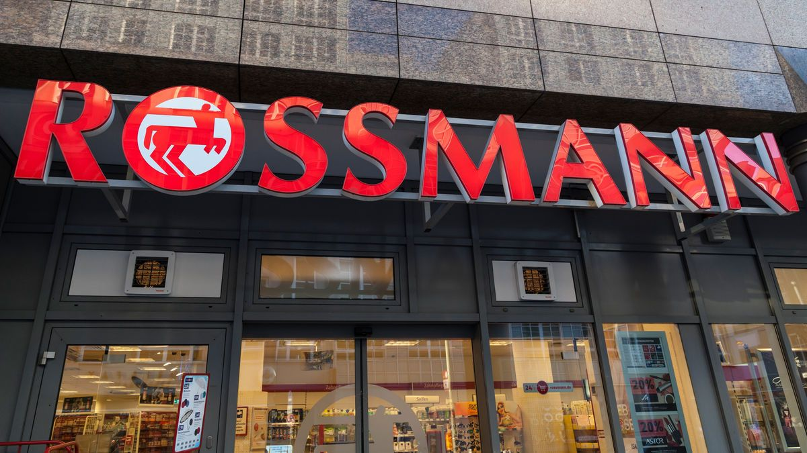

# ROSSMANN SALES PREDICTION MODEL

# About Rossmann
Rossmann is a prominent chain of drug stores operating across seven European countries, with over 3,000 stores in its network. The company offers a wide range of products, including pharmaceuticals, personal care items, beauty products, household goods, and more. Rossmann is known for its extensive product selection, competitive pricing, and convenient store locations. Founded in Germany in 1972 by Dirk Rossmann, the company has since expanded its presence across Europe, becoming one of the largest drug store chains in the region. Rossmann's stores are known for their modern and inviting layouts, making shopping convenient and enjoyable for customers.

## Problem Statement
Rossmann operates a large chain of drug stores across seven European countries, totaling over 3,000 stores. Store managers are responsible for predicting daily sales up to six weeks in advance, considering various influencing factors such as promotions, competition, holidays, seasonality, and locality. However, the accuracy of sales predictions varies among individual managers due to their unique circumstances and approaches.

To address this variability and improve forecasting accuracy, the task is to develop a robust machine learning model using historical sales data from 1,115 Rossmann stores. The objective is to accurately forecast the "Sales" column for the test set, considering factors like promotions, holidays, and other relevant features. This model will provide store managers with reliable sales forecasts, enabling them to optimize inventory management, staffing, and promotional strategies, thereby enhancing operational efficiency and maximizing revenue across Rossmann stores.

## Methodology
### Dataset
The project utilizes two datasets:
- **Rossmann Stores Data**: Contains daily sales, customer counts, store details, and promotional information.
- **Store Data**: Provides details about each store, including store type, assortment, and competition information.

### Data Exploration and Wrangling
The datasets are loaded, cleaned, and prepared for analysis. Missing values are handled, data types are adjusted, and relevant features are extracted.

### Data Visualization and Storytelling
Various charts and plots are created to understand relationships between variables and gain insights into sales patterns. These visualizations help identify key drivers of sales and inform model development. Exploratory Data Analysis (EDA) revealed insights such as:
- The linear relationship between customers and sales.
- The impact of promotions and holidays on sales.
- Seasonal sales patterns.

Data preprocessing involved:
- Converting date columns.
- Handling missing values.
- Encoding categorical features.
- Removing outliers.

### Hypothesis Testing
Statistical tests are performed to validate assumptions about the data and relationships between variables. These tests provide evidence for or against hypothetical statements about sales behavior.

### Feature Engineering and Pre-processing
Outliers are handled, data is scaled, and new features are created to enhance model performance. Categorical variables are transformed into numerical representations.

- **Feature Selection**: Random Forest is used to identify the most important features for predicting sales. This step reduces dimensionality and focuses the models on the most relevant information.

## Machine Learning Model Implementation
### ML Model Implementation
Five regression models are implemented: Linear Regression, Ridge Regression, Lasso Regression, Decision Tree Regression, and XGBoost. Hyperparameter tuning and cross-validation are applied to optimize model performance.

### Model Evaluation
The models are evaluated using metrics such as R-squared, Mean Squared Error (MSE), and Root Mean Squared Error (RMSE). These metrics assess the accuracy and predictive power of the models.

## Key Findings
- Store type, assortment, promotions, competition distance, and customer count are among the most important factors influencing sales.
- Sales are generally higher on weekdays and during promotions.
- School holidays and state holidays can impact sales.
- The XGBoost Regression model achieved the highest accuracy after hyperparameter tuning.

## Recommendations
- Utilize the XGBoost Regression model for sales prediction.
- Focus on optimizing promotions and store operations during peak sales periods.
- Consider the impact of store type, assortment, and competition when making business decisions.

  ## Requirements

- Python 3.x
- Libraries: `pandas`, `numpy`, `scikit-learn`, `matplotlib`, `seaborn`, etc.

## Conclusion
- Utilize insights on the impact of promotions to optimize promotional strategies, ensuring effective timing and types of promotions. Use sales forecasts to optimize staffing levels and inventory management, ensuring adequate resources during peak sales periods while minimizing excess stock.
- Plan staffing, promotions, and inventory management strategies in advance for holidays and school breaks, considering their impact on sales.
- Analyze individual store performance based on model predictions, identifying areas for improvement and implementing targeted strategies.
- Enhance the overall customer experience by tailoring promotions, product offerings, and store layouts to meet customer preferences and needs.
- Monitor the competitive landscape and adjust pricing, promotions, and marketing strategies accordingly to stay ahead of competitors.
